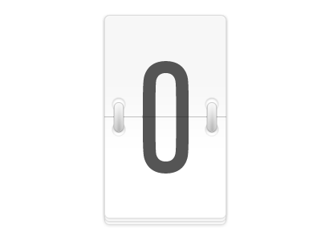

# Understanding Closures in JavaScript

### Close your eyes and imagine yourself in your kitchen 🍽️


#### Lexical Scope (Basic Case)

```javascript
function kitchen() {
  const food = "pizza";

  function eat() {
    console.log(`Eating ${food}`);
  }

  eat();
}

kitchen(); // Predict the output?
```

This is like eating pizza in the kitchen right now:

- The `food` variable is only accessible within the `kitchen` function
- The `eat` function is called immediately and only once
- Once `kitchen()` finishes, everything is cleaned up
- We can't access the pizza again after the kitchen function is done

#### Closure (Advanced Case)


```javascript
function kitchen() {
  const food = "pizza";

  return function eat() {
    console.log(`Eating ${food}`);
  };
}

const lunchbox = kitchen();
lunchbox(); // Predict the output?
lunchbox(); // Predict the output?
```

This is like getting a special lunchbox that keeps your pizza fresh:

- The `food` variable is "captured" by the returned `eat` function
- We can call the `eat` function multiple times
- The `food` variable persists in memory as long as we have a reference to the `eat` function
- We can use the `eat` function anywhere in our code

### So, What is a Closure? 🤔

A closure is a function that remembers and can access variables from its outer (enclosing) scope, even after the outer function has finished executing. Think of it as a function with a "memory" of its environment.

Closure => A Function that remembers its lexical scope


### Understanding Through Chrome DevTools > Sources Tab🔍

Try adding a breakpoint inside `eat` function and inspect the Scope panel, what do you see?

1. **Local**: Shows local variables for the current function
2. **Closure (kitchen function)**: Shows `food` variable - this is the closure in action!
3. **Script**: Shows top-level variables/functions
4. **Global**: Shows global objects and functions

### Problems and Solutions 💡


#### 1. Basic Counter



- Create a counter function that maintains its count between calls.
- Each time the function is called, it should increment and return the count.

```js
const counter = createCounter();
console.log(counter()); // 1
console.log(counter()); // 2
console.log(counter()); // 3
```

#### 2. Secret Holder


Create a function that can securely hold and manage a secret value. The function should return an object with two methods:

1. getSecret() - to retrieve the current secret value
2. setSecret(newSecret) - to update the secret value
   The secret should be private and only accessible through these methods.

```javascript
const holder = createSecretHolder("initial secret");
console.log(holder.getSecret()); // "initial secret"
holder.setSecret("new secret");
console.log(holder.getSecret()); // "new secret"
```

we used closures to create private variables and implement encapsulation in JavaScript

#### 3. Memoization


Create a memoized version of the double function
Double function - A simple function that takes a number and doubles it

```javascript
function double(x) {
  console.log("Calculating..."); // This will only run for new inputs
  return x * 2;
}

const memoizedDouble = memoize(double);

console.log(memoizedDouble(5)); // Calculating... 10
console.log(memoizedDouble(5)); // 10 (uses cached result)
console.log(memoizedDouble(5)); // 10 (uses cached result)
console.log(memoizedDouble(10)); // Calculating... 20
```

#### 4. Snore once button

Since you guys have been attentive for the past 10 minutes, I'll let you snore once

You can see a button to 'Snore' in your web page.Complete the definition of the createSnoreOnceHandler function, so that the button will let you snore only once.

### Key Takeaways 🎯

1. **Remember**: A closure is a function that remembers its lexical scope
2. **Best Practice**: Use closures to create private variables and maintain state
3. **Common Uses**: Module patterns, function factories, and maintaining state in async operations
4. **Debugging**: Use Chrome DevTools to inspect closure scopes

### Summary

Remember: A closure is like a lunchbox that keeps your variables fresh and accessible, even when you're far from the kitchen where they were created! 🍱
